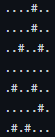

# Labrinto por Busca em Largura(BFS)

 
 

Busca em largura é um algoritmo normalmente ultilizado para realizar busca ou travessia em árvores, mas pode ser aplicado em outros casos também. Um desses casos é em matrizes, que podem ser labirintos, para chegar de uma determinada posição inicial até uma determindada posição final. Em labirintos essas posições seriam a entrada e saída dele. Para este algoritmo há duas estruturas importantes a matriz que é o labirinto e a Fila dinâmica que guarda o caminho percorrido.

  A estrutua da matriz possui um tamanho, uma largura, o dado de cada posição da matriz e as posições que poderá caminhar(Abaixo da posição, à esquerda da posição ou à direita da posição) e se esta posição já esteve na fila anteriormente. Esta irá representar um labirinto de tamanho n e largura m em que cada posição pode ter um dos tipos de dado a seguir:
  <ul>
    <li>"." - Simboliza um caminho passável no labirinto.</li>
    <li>"#" - Simboliza uma parede no labirinto.</li>
  </ul>
  E para um labirinto ser válido tem que exister pelo menos um caminho da entrada para o final. O labirinto a seguir é um labirinto 3x3 válido de exemplo:

  

  A estrutura fila dinâmica será utilizada para guardar o caminho tomado da entrada para chegar na saída. A fila dinâmica é uma variante do modelo de fila estática, onde há um ponteiro que aponta para o início da fila, um ponteiro que aponta para o fim da fila e os dados que possuem um valor que é passado para chegar nele. A estrutura pode ser vista pela visualização gráfica abaixo:  

  

  Com as estruturas explicadas agora vamos entender como o método BFS funciona. Primeiro a posição inicial é adicionada a pilha, depois o algoritmo retira a primeira posição da fila e olha seus "vizinhos" conferindo as posições possíveis, sendo abaixo, à direita, à esquerda ou acima nesta ordem  (Neste último caso, considerado como voltar). Quando essa verificação se torna possível, essa posição é adicionada a fila.  Após isto, o algoritmo o algoritmo vai pegar a novamente a primeira posição da fila e verificar se há algum outro caminho para se mover nela, se houver, o mesmo vai repetir o último processo descrito até a última posição da fila for a posição final do labirinto.

  Verificação das posições ao redor para mover na direção, no exemplo o algoritmo primeiramente irá para baixo, depois para direita, depois para esquerda e por último para cima:

  <i

  Conclusão do labirinto e sua fila:

  

# Algoritmo
<h3>fila.h e fila.c</h3>

Nessa estrutura temos a função Enfilera e Desenfilera, a função FFVazia, que inicializa a fila com valores nulos, e a função imprime, que imprime os valores obtidos na fila. 

<h3>labirinto.h e labirinto.c</h3>

 Utilizou-se as estruturas Cell e Fila para a criação da matriz e fila e análise das posições ao caminhar no labirinto. As funções inicializar e finalizar se refere a inicialização e finalização do labirinto. Com isso, é possivel imprimir o mesmo ultilizando a função ImprimirLab.

A função LerArquivo permite a leitura de arquivo em que está inserido o labirinto. Para a realização da leitura correta é necessário que o labirinto seja descrito no formato de matriz e considerando "." como passagem/caminho livre e "#" como a parede que impede de seguir o caminho, além disso é preciso inserir o nome do arquivo com sua extensão para evitar erros. Veja o exemplo a seguir: 

  

A função checkLast verifica se a posição é a última da matriz definida pelo labirinto.

    Interações

    As interações são definidas pela função BFS, sendo tratadas através das inserções(enfileiramento) dentro da fila, desconsiderando a desenfileração dos valores.

<h3>main.c</h3>

No main, inicializamos a fila vazia e em seguida pedimos ao usuário o número de linhas e colunas do labirinto disponível no arquivo e consequentemente pedimos o nome do arquivo com a extensão. Inicializamos o labirinto e a leitura do arquivo, para conferir se a leitura esta correta, imprimos o labirinto - para questões de comparação (caso o usuário queira conferir o resultado) e atribuimos a variavél iteracoes a função BFS e mostramos o resultado final de interações. Finalizamos a fila e o labirinto no final.

# Compilação e Execução

A lista dinâmica disponibilizada possui um arquivo Makefile que realiza todo o procedimento de compilação e execução. Para tanto, temos as seguintes diretrizes de execução:

| Comando                |  Função                                                                                           |                     
| -----------------------| ------------------------------------------------------------------------------------------------- |
|  `make clean`          | Apaga a última compilação realizada contida na pasta build                                        |
|  `make`                | Executa a compilação do programa utilizando o gcc, e o resultado vai para a pasta build           |
|  `make run`            | Executa o programa da pasta build após a realização da compilação                                 |

Trabalho realizado Gabriel Júnior Teixeira e Lívia Gonçalves - Maio/2022

